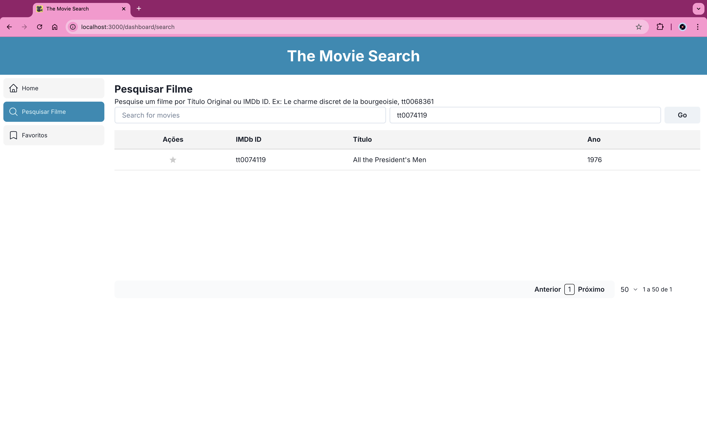
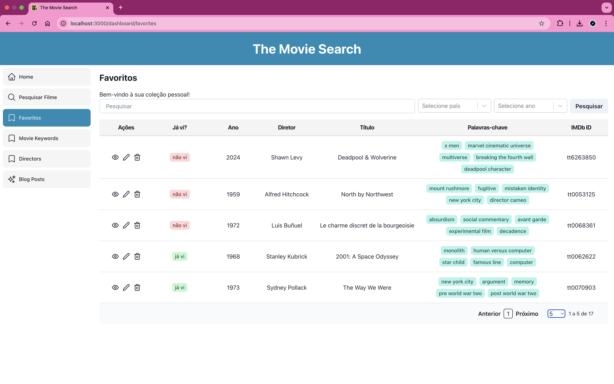
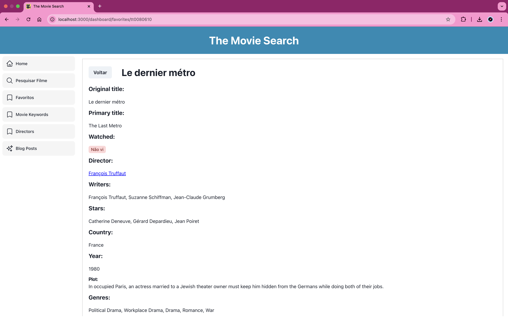

# The Movie Search

É uma aplicação centrada na experiência do amante de cinema. 

Backend deste projeto: https://github.com/francisdiasbr/movie-search-backend

O usuário pode pesquisar por filmes, obter informações sobre eles, salvá-los em uma lista de favoritos e editá-los.






## Features

### 1. Pesquisa de Filmes

O usuário pode pesquisar por um filme através do nome do filme ou do código IMDb (ex: tt0111161). O catálogo de filmes é fornecido pelo IMDb e contém a base de dados completa.

Como resultado, a resposta fornece uma tabela populada contendo filmes relacionados à pesquisa.

Ao pesquisar por um filme, o usuário pode:
  - Ver apenas 3 informações do filme: o nome do filme, o código IMDb o ano de produção.
  - Favoritar um filme em sua coleção de favoritos.


### 2. Coleção de Favoritos

O usuário tem uma lista de favoritos onde pode:
  - Ver todos os filmes favoritos.
  - Editar as informações de um filme favorito (link da Wikipedia e trilha sonora do filme no Spotify).
  - Excluir um filme favorito.


### 3. Visualização de Filme Favorito

O usuário pode visualizar as informações de um filme favorito:
  - Nome do filme
  - Código IMDb
  - Diretor
  - País
  - Ano de lançamento
  - Roteiro / Plot
  - Plot Keywords (palavras chaves associadas ao filme)
  - Link do filme na Wikipedia
  - Trivia / Curiosidades (lista de fatos interessantes sobre o filme)
  - Quotes (lista de frases célebres do filme)
  - Trilha sonora do filme (integração com o Spotify)
  - Magnet Link para download do filme


## Rodando a aplicação

Antes de iniciar a aplicação, é imprescindível que o backend esteja em execução. Você pode encontrar as instruções para configurar e rodar o backend neste repositório: [movie-search-backend](https://github.com/francisdiasbr/movie-search-backend).

### Passos para rodar a aplicação:

1. **Instale as dependências**:
   ```bash
   npm install
   # ou
   yarn
   ```

2. **Inicie o servidor de desenvolvimento**:
   ```bash
   npm run dev
   # ou
   yarn dev
   ```

## Uso de Magnet Links

Esta aplicação permite o uso de magnet links para download de conteúdo. Os magnet links são uma forma de compartilhar arquivos via protocolo BitTorrent, permitindo downloads descentralizados.

### Aviso Legal
- **Conteúdo**: Certifique-se de que o conteúdo que você está baixando ou compartilhando é legal e não infringe direitos autorais.
- **Responsabilidade**: A responsabilidade pelo uso de magnet links e pelo conteúdo baixado é exclusivamente do usuário. A aplicação não se responsabiliza por qualquer uso ilegal.
