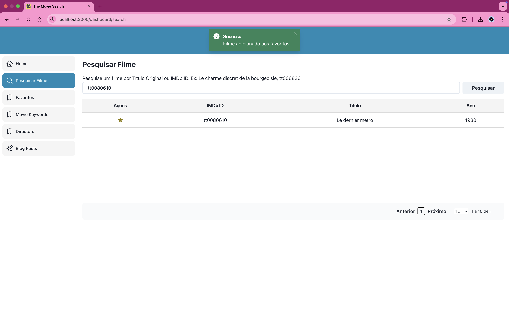

# The Movie Search

É uma aplicação centrada na experiência do amante de cinema. 

Baseia-se no consumo do catálogo fornecido pelo IMDb (Internet Movie Database). 

O usuário pode pesquisar por filmes, obter informações sobre eles, salvá-los em uma lista de favoritos e editá-los.





## Features

### 1. Pesquisar Filme

Pesquise um filme em um banco de dados completo de filmes. 
Como resultado, a resposta fornece uma tabela populada contendo filmes relacionados à pesquisa.

Na tabela de filmes, você pode ver o nome do filme, o ano de produção, a classificação e o número de votos:
- Salve um filme em uma lista de desejos classificada
- Obtenha informações sobre o filme: ano, , principais atores, país
- Edite as informações de um filme (nome do filme, ano de lançamento, link da trilha sonora, link da Wikipedia)


- Ouça a trilha sonora no Spotify
- Tenha acesso ao Magnet Link do torrent para assistir ao filme

Next:
- Salve suas citações favoritas no cartão do filme
- Percepções do filme
  - Contexto histórico
  - Figurino
  - Premiações


## Getting Started

instale as dependências
```bash
npm install
# or
yarn
```


Rode o servidor de desenvolvimento

```bash
npm run dev
# or
yarn dev
```

## Uso de Magnet Links

Esta aplicação permite o uso de magnet links para download de conteúdo. Os magnet links são uma forma de compartilhar arquivos via protocolo BitTorrent, permitindo downloads descentralizados.

### Aviso Legal
- **Conteúdo**: Certifique-se de que o conteúdo que você está baixando ou compartilhando é legal e não infringe direitos autorais.
- **Responsabilidade**: A responsabilidade pelo uso de magnet links e pelo conteúdo baixado é exclusivamente do usuário. A aplicação não se responsabiliza por qualquer uso ilegal.
